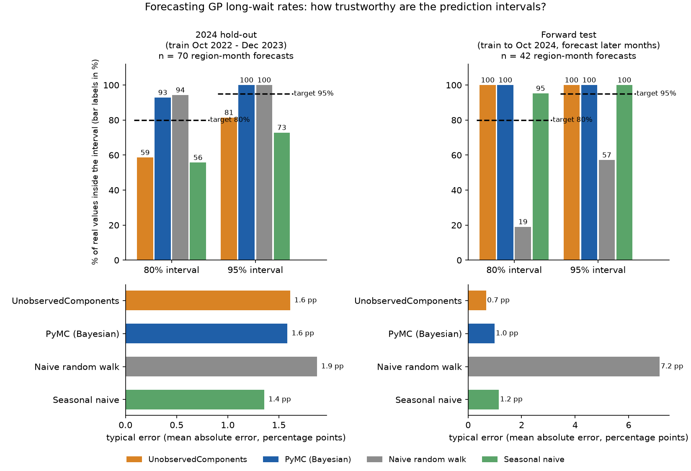
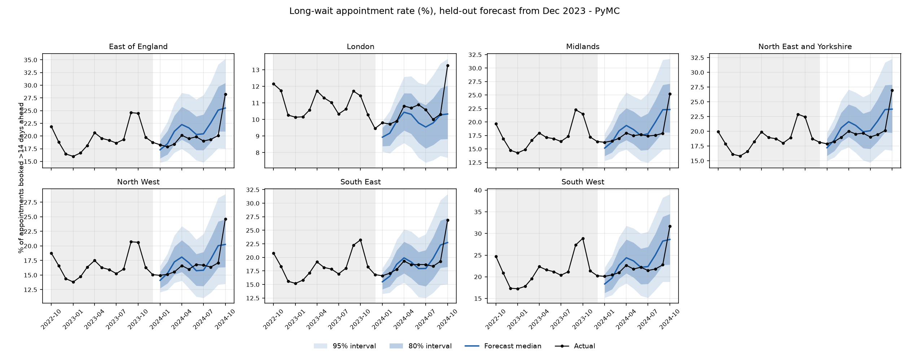
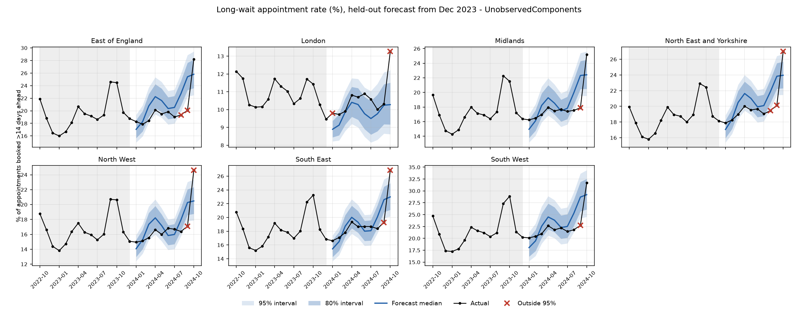
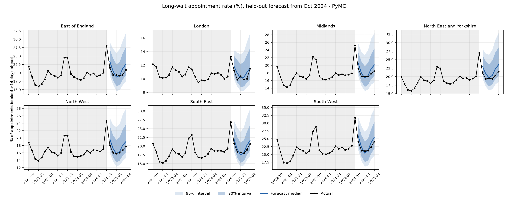
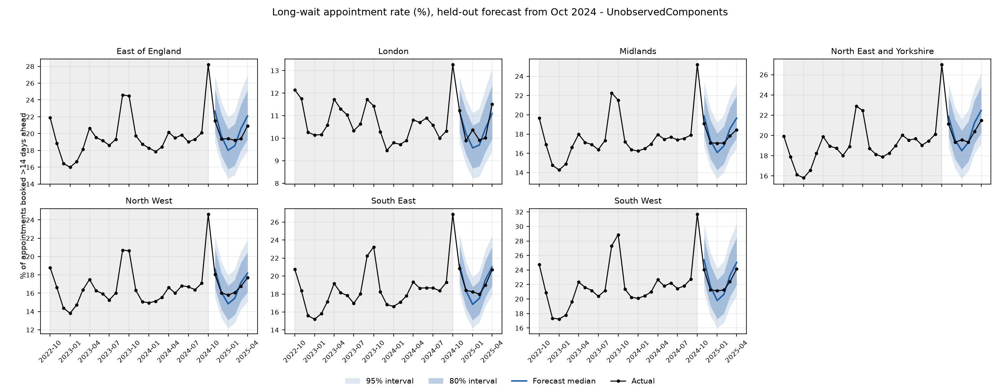

# Probabilistic forecasting of NHS GP long-wait appointment rates

An extension of my MSc dissertation, *Mapping the Wait: Regional, Temporal and Socioeconomic Predictors of GP
Appointment Delays in the NHS (2022–2024)*. The dissertation asked **what is associated with long waits**. This project
asks **can we forecast them a few months ahead, and can we trust the uncertainty around the forecast?**

* **Forecast target:** the **long-wait rate** = the share of GP appointments booked **15 or more days ahead**, for each of
  the **7 NHS England regions**, month by month, 3–6 months ahead.
* **Models:** a Bayesian structural time series (trend + seasonality) fitted two ways, `statsmodels`
  `UnobservedComponents` and a Bayesian model in `PyMC`, compared with two naive baselines.
* **How they are judged:** primarily **interval coverage**: do about 80% (95%) of the real values land inside the 80% (95%)
  prediction interval? Point error (RMSE/MAE) is reported too, for reference.
* **Data:** real NHS Digital *Appointments in General Practice* practice-level releases (Dec 2022 – Jun 2025 releases),
  covering Oct 2022 – Apr 2025. **No synthetic data in any result below.**



## What I found

Two tests, both against real figures the models never saw. Full tables:
[`results/coverage_table.md`](results/coverage_table.md) (2024 hold-out) and
[`results/forward_coverage_table.md`](results/forward_coverage_table.md) (forward test). Pooled over 7 regions.

| | Model | 80% interval covers | 95% interval covers | 95% width (pp) | Typical error (MAE, pp) |
|---|---|---|---|---|---|
| **Test 1: 2024 hold-out** (train Oct 2022 – Dec 2023, 15 months; forecast Jan–Oct 2024; n = 70) | UnobservedComponents | 59% | 81% | 5.0 | 1.6 |
| | **PyMC** | **93%** | **100%** | 10.6 | 1.6 |
| | Naive random walk | 94% | 100% | 17.2 | 1.9 |
| | Seasonal naive (same month last year) | 56% | 73% | 3.7 | 1.4 |
| **Test 2: forward test** (train to Oct 2024, 25 months; forecast Nov 2024 – Apr 2025; n = 42) | UnobservedComponents | 100% | 100% | 6.4 | 0.7 |
| | PyMC | 100% | 100% | 10.5 | 1.0 |
| | Naive random walk | 19% | 57% | 18.4 | 7.2 |
| | Seasonal naive | 95% | 100% | 5.8 | 1.2 |

Plain-English reading:

1. **PyMC gave the most trustworthy intervals in the 2024 hold-out.** About 93% of real values fell inside its 80%
   interval (target 80%) and all fell inside the 95% one, so if anything it is a little cautious. UnobservedComponents (UC)
   was over-confident: its 80% interval caught 59% and its 95% interval 81%, and it got worse the further ahead it
   forecast (32% / 57% at 7+ months).
2. **The structural models did *not* beat "same month last year" on point accuracy in 2024** (seasonal naive error 1.4 pp vs
   1.6 pp). Seasonal naive's intervals, though, are far too narrow (56% / 73%). So the value of the models is the
   *calibrated uncertainty*, not a more accurate central forecast. That is worth saying plainly.
3. **October 2024 was the hard month.** Every region jumped well above anything in the 2022–23 training window (national
   rate 25.1% vs 21.6% a year earlier). Excluding that month, PyMC covers 95% / 100% and UC 63% / 86%. For October
   2024 alone, PyMC's intervals contained 71% (80%) and 100% (95%) of regions; UC's only 14% and 43%.
4. **With two full seasonal cycles of training (Test 2), both models did much better:** UC and PyMC contained every
   real value, with typical error of 0.7 and 1.0 pp (vs 1.6 pp in Test 1). UC was both the most accurate and the sharper of the
   two; PyMC's intervals are wider (10.5 vs 6.4 pp), i.e. more cautious than needed here. This is consistent with
   "more history helps", but it is **not proven**: the two tests also cover different months (Test 1 includes the Oct 2024
   spike; Test 2's Nov 2024 – Apr 2025 is calmer).
5. **The plain random walk is a poor benchmark in Test 2** (19% / 57%) because its forecast origin *is* the October peak,
   so it carries the spike forward as if permanent. That is why I added the seasonal naive baseline as the fairer comparison.
6. **After the spike the level settled higher, not back to the old baseline:** national rate about 1 pp above the same month a
   year earlier from Dec 2024 to Apr 2025 (0.8–1.1 pp; e.g. 17.2% vs 16.3% in Dec; 19.1% vs 18.1% in Apr), after +3.5 pp in October and +2.0 pp in November.

### Forecast plots (real data: black = actual, blue = forecast median with 80%/95% intervals, red × = outside 95%)

2024 hold-out (trained on Oct 2022 – Dec 2023):




Forward test (trained to Oct 2024, forecasting Nov 2024 – Apr 2025):




### Caveats on these numbers (read before quoting them)

1. **Regions move together.** All seven rise and fall at the same time, so 70 (or 42) pooled forecasts behave more like
   10 (or 6) independent ones. The confidence intervals in the tables assume independence and are too narrow. "100%" in Test 2
   means *nothing was missed*, which is weaker evidence of calibration than it sounds; treat coverage as direction, not precise rates.
2. **Short history.** 15 training months is 1.25 seasonal cycles; 25 is about two. Seasonality is learned from very few peaks.
3. **Seasonal naive's spread** is estimated from only ~3 year-on-year differences in Test 1, so its interval width is itself unreliable.
4. **One hold-out year and one 6-month forward window.** Rolling-origin results (refit every 3 months, h ≤ 6, n = 119) are
   in the table file; they tell the same story (PyMC 78% / 93%, UC 61% / 76%, seasonal naive 57% / 72%, random walk 87% / 93%).

### Sampler health (PyMC)

* 2024 hold-out fits (one per region): max R-hat 1.01, minimum bulk ESS 581, **2–14 divergent transitions per 2,000 draws
  (0.1–0.7%)**. Forward-test fits: max R-hat 1.01, minimum bulk ESS 523, **1–4 divergences** (fewer with 25 observations).
* R-hat and ESS are good, but divergences are not zero: with so few observations the level-innovation scale is weakly
  identified (a `sigma → 0` funnel), so I would not lean on the tails of that one parameter. Diagnostics were saved for the
  single-origin fits only, not for each rolling-origin refit.
  Per-region ArviZ summaries, trace plots and `.nc` files are written to `outputs/pymc_diagnostics/` when you run the pipeline.
  Headline numbers: [`results/sampler_health.json`](results/sampler_health.json),
  [`results/forward_sampler_health.json`](results/forward_sampler_health.json).

## How this connects to the dissertation

Same source, same window start, same release logic (Dec 2022 – Dec 2024 releases because of the 3-month refresh), same
ONS Postcode Directory (Feb 2024) for geography. I carried over the dissertation's finding of **October and spring peaks**
into the model design (see below), and checked that the series reproduce the dissertation's patterns
([`results/dissertation_crosscheck.md`](results/dissertation_crosscheck.md)):

* **Calendar month vs January:** correlation **0.99** with the dissertation's Table 1 rate ratios, and the **same top four
  months (October, September, April, May)**. Several months match almost exactly (e.g. Feb 1.024 vs 1.024; Nov 1.122 vs 1.123).
* **Region vs London:** rank correlation **0.93**; London lowest and South West highest in both.
* This is a sanity check on direction and ordering using raw aggregate rates; Table 1 is a practice-level mixed model adjusted
  for deprivation, rurality and staffing, so they are not expected to match exactly.

Differences to be aware of: the dissertation models **practice-level counts** with an offset (a rate); this project forecasts
the **regional aggregate share**. The dissertation text says "more than 15 days" but its category begins at "15 to 21 Days",
i.e. **15 days or more**; this project uses the same bands. Deprivation, rurality and GP staffing are not used here: the
forecasts use each region's own history (trend + seasonality) only.

## Data and definitions

* **Source:** NHS Digital Appointments in General Practice, practice-level crosstab zips (`Practice_Level_Crosstab_<Mon>_<YY>.zip`).
* **Long wait:** `TIME_BETWEEN_BOOK_AND_APPT` bands "15 to 21 Days", "22 to 28 Days", "More than 28 Days". Rate = long-wait
  appointments / appointments with a known wait ("Unknown / Data Quality" excluded). **All appointment statuses are included**
  (no "Attended" filter), which matches the dissertation's pattern most closely and is consistent across all months (the Dec 2022
  and Jan 2023 releases have no status column, so a filter could not have been applied evenly).
* **Which release supplies which month (3-month refresh):** each month's figure comes from the latest release published
  **≥ 2 months later** that contains it (`select_final_months` in `src/nhs_forecast/data.py`; provenance in
  `data/processed/release_provenance.csv`). All 31 months have a final release. Months split over several CSVs in a zip are summed.
* **Regions:** the files have only `SUB_ICB_LOCATION_CODE`. I derived sub-ICB → NHS England region from the ONS Postcode Directory
  (majority `nhser` over each sub-ICB's live postcodes, bridged to ODS codes through the ONSPD `Documents/` lookups):
  106 sub-ICBs → 7 regions, none with a split majority, and the build reported no unmapped sub-ICB codes (`scripts/00b_build_region_lookup.py`).
* **Not controlled for:** appointment *type* (`NATIONAL_CATEGORY`). Planned or vaccination clinics booked far ahead may drive the
  autumn peak; I have not tested this.

## Method and design choices

* **Logit scale.** Rates are modelled as `logit(rate)` so forecasts and intervals stay in (0, 1); back-transforming quantiles is
  exact because the logit is monotone. Each region is fitted separately.
* **Structure (identical in UC and PyMC, so the comparison is fair).** Random-walk level with constant drift (`lldtrend`) +
  **deterministic trigonometric seasonality with 2 harmonics** + observation noise. Two harmonics let the annual cycle carry the
  autumn peak and a semi-annual component carry the spring bump, using 4 parameters instead of 11 free monthly effects, which
  matters with 15–25 observations. Seasonality is fixed, not stochastic, for the same reason. The cost: two harmonics smooth a
  sharp ~2-month peak, which probably contributes to under-predicting peak height.
* **UC (`models/uc.py`).** `statsmodels.tsa.UnobservedComponents`: maximum-likelihood variances, Kalman-filter forecast variance.
  Intervals condition on the *estimated* variances and ignore parameter uncertainty; with ~15 points the ML variances are noisy and
  tend to be too small, which is the most likely reason for its under-coverage in Test 1.
* **PyMC (`models/bayes.py`).** The same model with weakly informative priors (logit units). The latent random walk is
  **marginalised analytically** (`y ~ MvNormal(level0 + drift·t + Xβ, σ_level²·min(s,s') + σ_obs²I)`), so NUTS samples only six
  parameters (an earlier version sampling all latent states gave dozens of divergences and R-hat > 1.05). Forecasts are the exact
  Gaussian conditional given the data, drawn once per posterior sample, so they include parameter uncertainty. `target_accept=0.99`,
  4 chains, seeded.
* **Baselines.** *Naive random walk* (last value, variance from training differences) and *seasonal naive* (same month last year,
  spread from year-on-year differences; `models/naive.py`).
* **Validation.** Primary metric: empirical coverage of the 80% and 95% central intervals (Wilson CIs), alongside mean width, the
  interval score (rewards sharp intervals subject to calibration), and RMSE/MAE. *Fixed origin:* fit once, score every later month.
  *Rolling origin:* expanding-window refit every 3 months, horizon ≤ 6. Reported by horizon bucket (1–3, 4–6, 7+).

## Things I would do next

1. More history (the NHS series starts earlier than Oct 2022) so seasonality is learned from three or more cycles.
2. Break out or exclude planned/vaccination appointment categories and see whether the autumn peak is a category effect.
3. A hierarchical PyMC model sharing seasonal shape across regions (partial pooling), which also addresses the correlated-regions caveat;
   and a parameter-uncertainty-aware UC interval as a fairer UC baseline.
4. Calibrate horizon-dependent width (PyMC is cautious at long horizons).

## Reproduce

```bash
python -m venv .venv && source .venv/bin/activate      # Windows: .venv\Scripts\Activate.ps1
pip install -r requirements.txt -e .

# Everything downstream runs from the committed regional table (~30-40 min, mostly PyMC)
scripts/run_all.sh

# or step by step
python scripts/02_fit_models.py --models uc pymc                     # train Oct22-Dec23, forecast 2024 + ArviZ diagnostics
python scripts/03_backtest.py --models uc pymc naive snaive          # coverage table (outputs/tables/)
python scripts/04_plot_forecast.py --models uc pymc
python scripts/06_forward_test.py --models uc pymc naive snaive      # train to Oct 2024, forecast later months (outputs/forward/)
python scripts/07_summary_figure.py                                  # results/summary.png
python scripts/05_dissertation_crosscheck.py                         # compare with dissertation Table 1
pytest                                                               # unit tests

# Rebuilding the regional table from raw NHS files (large; stays on your machine, git-ignored)
#   put the release zips in data/raw/, then:
python scripts/00_check_headers.py
python scripts/00b_build_region_lookup.py --onspd path/to/ONSPD_FEB_2024_UK.zip
python scripts/01_prepare_data.py --level region_lookup --all-statuses --end 2025-04-01
```

`scripts/01_prepare_data.py --synthetic` makes clearly-labelled **synthetic** data in the same schema for testing the pipeline
without the NHS files; its output is tagged `source=synthetic` and is not NHS data. Randomness is seeded (`config.SEED`; PyMC seed =
SEED + region index). Layout: `src/nhs_forecast/` (library), `scripts/` (numbered pipeline), `data/{raw,processed,external}`,
`results/` (committed final outputs), `tests/`.
